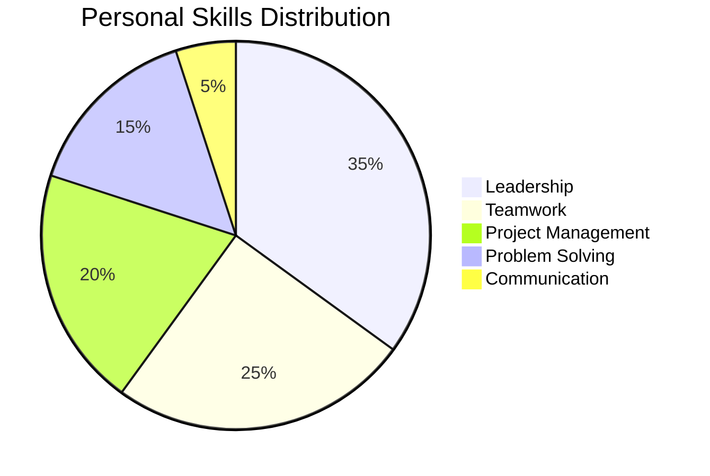
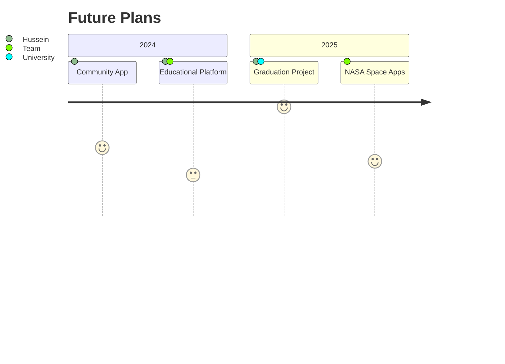

# Hussein Yehya - Tech Enthusiast & Team Leader

## 👋 Introduction
I'm Hussein Yehya, a passionate student and developer driven by technology and innovation. I strive to transform creative ideas into tangible projects through teamwork and dedication.

## 🔗 Connect with Me

## 🚀 Leadership Experiences

### Founder & Leader, Technical Team  
**Martyr Medhat Talaat School** (2022 - 2023)
- Established the school's first official technical team.
- Led a team of 19 members (programmers, designers, and specialists).
- Developed successful technical projects showcased at the Qalyubia Science and Engineering Fair.

### Founder & Leader, Watan Vision Team  
**(2023 - Present)** | [GitHub: Watan Vision](https://github.com/Watan-Vision)
- Founded a volunteer team dedicated to serving the community through technology.
- Developed technical solutions for local challenges.
- Organized workshops to enhance technical skills among youth.

### Organizer & Leader, E3raf Baladak Initiative  
**(Present)** | [E3raf Baladak](https://e3rafbaladak.com)
- Leading a community-driven initiative to promote cultural and educational awareness through technology.

## 💻 Technical Skills

### Programming Languages

### Tools & Technologies

### Soft Skills

## 🏆 Achievements

### Notable Participations

### Qalyubia Fair Project
- Developed a comprehensive technical project with a 19-member team.
- Secured official school support and team ID cards.
- Qualified for governorate-level competition.

## 📚 Education
**Martyr Medhat Talaat Official Languages School** (2015 - Present)
- Grade 10 - Specialization: Science and Mathematics
- Cumulative Grade: Excellent
- President of the Technology Club

## 🌟 Future Projects

## 💼 Volunteer Work
- Technical Support at School Events (2018 - Present)
- Technical Mentor, Coding Club (2020 - 2022)
- Organizer, School Science Fairs (2021 - 2023)
- Volunteer, Environmental Awareness Initiatives (2019 - 2020)

## 📖 Interests
- Developing small-scale programming projects
- Participating in technical competitions
- Reading about Artificial Intelligence
- Self-learning via platforms like Coursera and edX

## 📈 GitHub Stats

## ✍️ Quote
*"Innovation is seeing what everybody sees and thinking what nobody thinks."*  
— Albert Einstein

## © 2025 Hussein Yehya - All Rights Reserved

